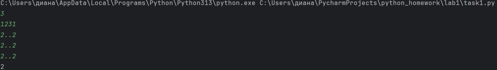
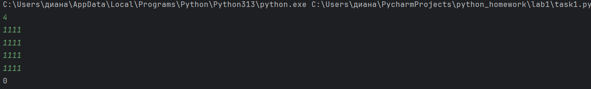

# Отчет по лабораторной работе №1
## Задача
### Есть игровое поле 4×4 с точками и цифрами от 1 до 9. Играют два игрока. Каждый может нажать одновременно k клавиш. 
### Если в момент времени t (от 1 до 9) на поле есть клавиши с цифрой t, и их количество не больше, чем могут нажать оба игрока вместе (2k), 
### то команда получает 1 балл. Нужно посчитать общее количество баллов.
## Идея решения:
## Нам нужно:
1. Посчитать, сколько раз встречается каждая цифра на поле.
2. Проверить для цифр от 1 до 9:
- Если цифра встречается хотя бы 1 раз и её количество ≤ 2k → прибавляем 1 балл.
- Иначе -> ничего не делаем.

# Решение:
``` python
k = int(input())  #сколько клавиш нажимает один игрок

#счётчики для цифр 1-9
counts = [0] * 10  #индекс 0 не используем

#читаем 4 строки поля
for i in range(4):
    row = input()
    for ch in row:
        if ch != '.':          #если не точка, значит цифра
            digit = int(ch)    #превращаем символ в число
            counts[digit] = counts[digit] + 1 #увеличиваем счетчик на 1

#сколько клавиш могут нажать оба игрока вместе
max_press = 2 * k

#считаем баллы
score = 0
for t in range(1, 10):         #t от 1 до 9
    if counts[t] > 0 and counts[t] <= max_press:
        score = score + 1

print(score)
```
# Итог работы программы:



